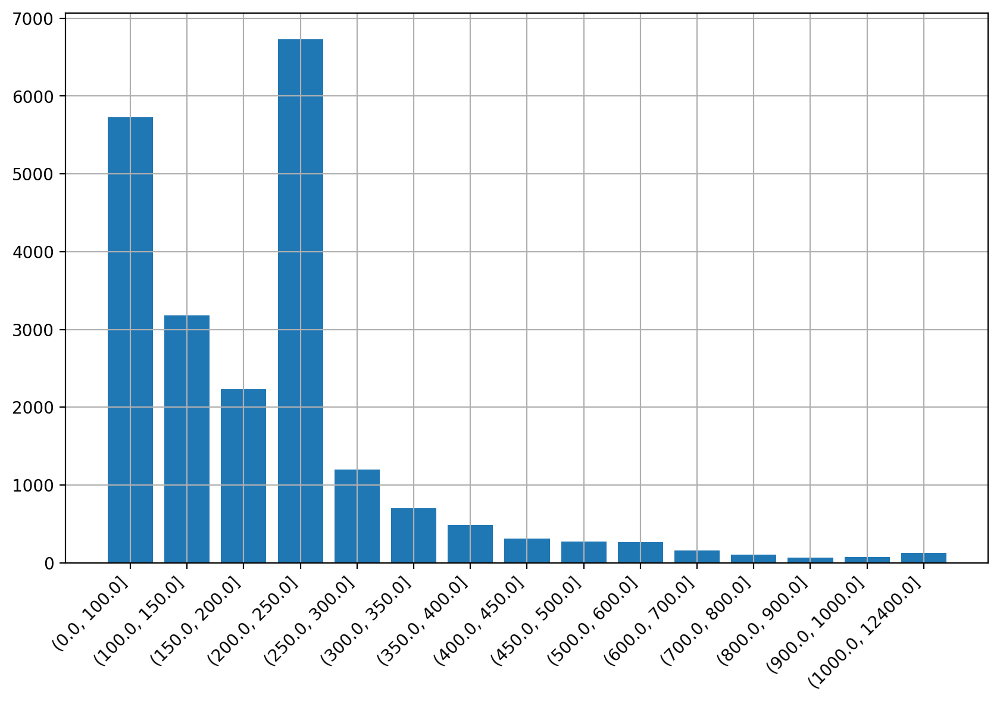
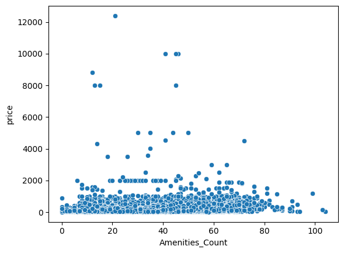
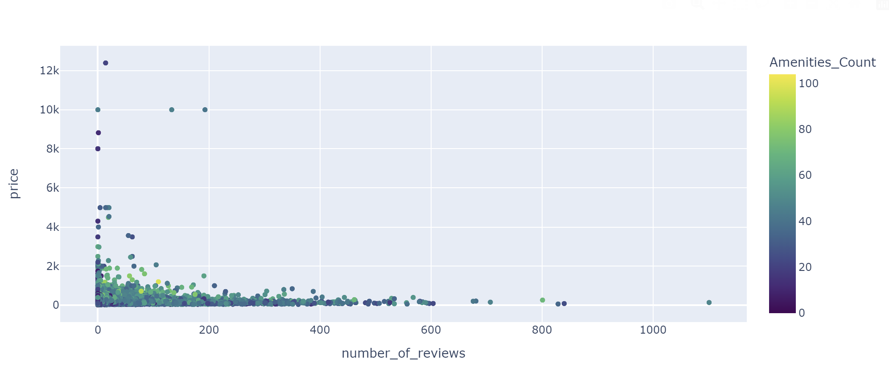

# HEAD
This project presents SmartStay Solutions, a conceptual tool designed to address key challenges faced
by Airbnb hosts. In the competitive short-term rental market, hosts struggle with optimizing pricing strategies
and selecting profitable locations for their listings. SmartStay Solutions aims to solve these issues by
leveraging data analytics and machine learning algorithms.
=======
## AirBnb master tool

### Price Range

### Amenities_Count relation with price

### Review, price and amenities count

